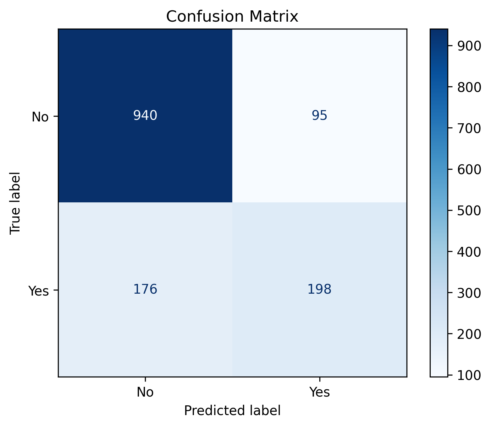
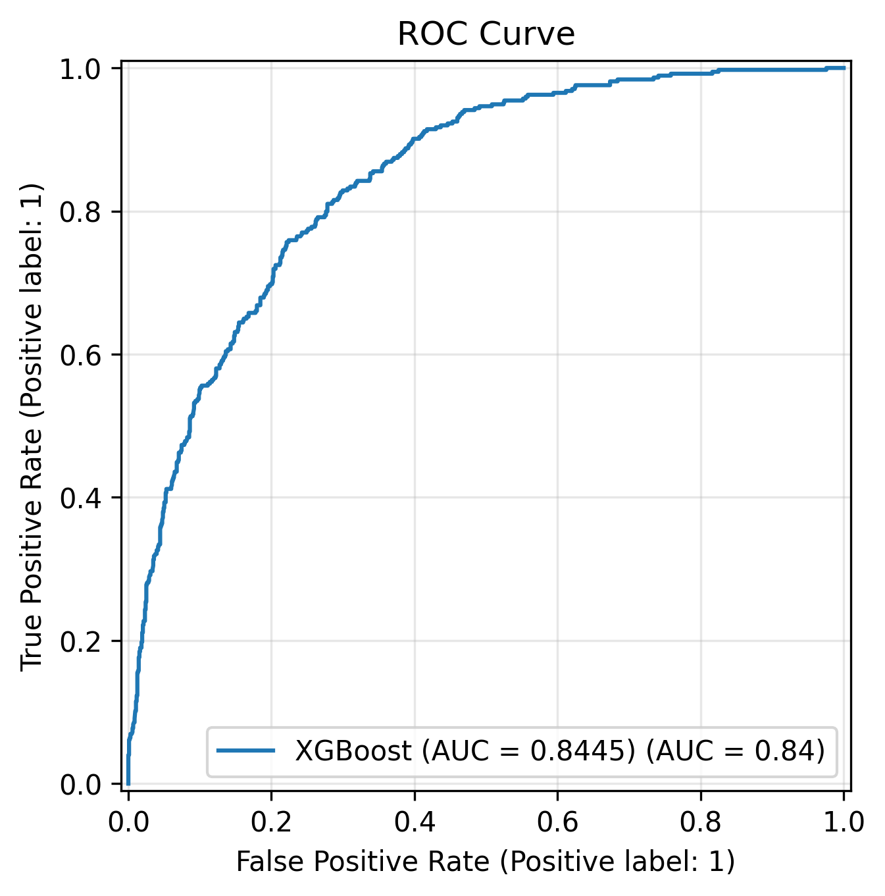
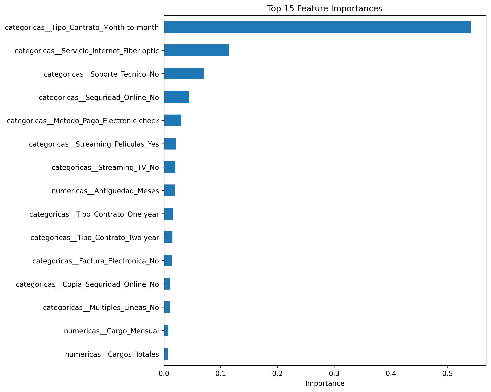

# 📉 Telecom Customer Churn Prediction

Machine Learning project focused on predicting customer churn in the telecommunications industry using classification models, hyperparameter optimization, and business-oriented model interpretation.

---

# 📖 Project Overview

Customer churn is one of the biggest challenges faced by telecommunications companies. Acquiring new customers is usually more expensive than retaining existing ones, making churn prediction a valuable business application.

This project develops a complete Machine Learning workflow using the IBM Telco Customer Churn dataset, covering every stage of the data science lifecycle.

The project includes:

- Data Cleaning
- Exploratory Data Analysis (EDA)
- Data Preprocessing
- Feature Engineering
- Machine Learning Modeling
- Hyperparameter Optimization
- Model Evaluation
- Model Interpretation
- Business Recommendations

---

# 🎯 Business Objective

The objective of this project is to identify customers at risk of leaving the company before they churn.

By predicting customer churn, telecommunications companies can prioritize retention campaigns, improve customer loyalty, and optimize marketing resources.

---

# 📊 Dataset

**Source:** IBM Telco Customer Churn Dataset

- **Observations:** 7,043 customers
- **Problem Type:** Binary Classification
- **Target Variable:** Churn

---

# 📂 Repository Structure

```text
telecom-customer-churn-prediction/
│
├── data/
│   ├── raw/
│   │   └── telco.csv
│   │
│   └── processed/
│       ├── telco_limpio.csv
│       ├── X_train_preprocesado.csv
│       ├── X_test_preprocesado.csv
│       ├── y_train.csv
│       └── y_test.csv
│
├── images/
│   ├── confusion_matrix.png
│   ├── feature_importance.png
│   └── roc_curve.png
│
├── notebooks/
│   ├── 01_Comprension_del_Negocio_y_de_los_Datos.ipynb
│   ├── 02_EDA.ipynb
│   ├── 03_Preprocesamiento_Datos.ipynb
│   ├── 04_Modelado.ipynb
│   ├── 05_Optimizacion_de_modelos.ipynb
│   └── 06_Interpretacion_del_modelo_y_conclusiones_de_negocio.ipynb
│
├── PROJECT_PLAN.md
├── README.md
├── requirements.txt
└── .gitignore
```

---

# 📋 Project Workflow

The project follows a structured Machine Learning workflow divided into six notebooks:

| Notebook | Description |
|----------|-------------|
| **01** | Business Understanding and Data Cleaning |
| **02** | Exploratory Data Analysis (EDA) |
| **03** | Data Preprocessing |
| **04** | Machine Learning Modeling |
| **05** | Hyperparameter Optimization |
| **06** | Model Interpretation and Business Conclusions |

---

# 🤖 Models Evaluated

The following classification algorithms were evaluated:

- Dummy Classifier
- Logistic Regression
- Decision Tree
- Random Forest
- XGBoost

The best-performing models were optimized using **GridSearchCV** with **5-fold Cross Validation**.

---

# 🛠️ Technologies Used

- Python
- Pandas
- NumPy
- Matplotlib
- Scikit-learn
- XGBoost
- Git
- GitHub

---

# 📈 Final Results

| Metric | Score |
|---------|------:|
| Accuracy | **0.8077** |
| Precision | **0.6758** |
| Recall | **0.5294** |
| F1-score | **0.5937** |
| ROC-AUC | **0.8445** |

XGBoost achieved the best overall performance after hyperparameter optimization.

Although Logistic Regression obtained a slightly higher Recall, XGBoost provided the best balance between predictive performance and overall model generalization.

---

# 📊 Model Performance

## Confusion Matrix



---

## ROC Curve



---

## Feature Importance



---

# 💼 Business Insights

The analysis identified several factors strongly associated with customer churn:

- Customers with **month-to-month contracts** present the highest churn risk.
- **Fiber optic internet service** is one of the most influential variables.
- Customers without **technical support** are more likely to churn.
- The absence of **online security services** is associated with higher churn.
- Customers using **Electronic Check** as their payment method show a greater probability of leaving the company.

These findings can support customer retention strategies by enabling the company to identify high-risk customers and prioritize proactive interventions.

---

# ⚠️ Project Limitations

Some limitations should be considered:

- The dataset presents a moderate class imbalance.
- Additional customer behavior variables could improve predictive performance.
- Feature importance indicates relevance for prediction, not causality.
- The default classification threshold (0.50) was maintained throughout the project.
- Model performance may evolve as customer behavior changes over time.

---

# 🚀 Future Improvements

Possible future enhancements include:

- SHAP values for model explainability.
- Classification threshold optimization.
- Model deployment using FastAPI or Flask.
- Interactive dashboard for business users.
- Automated model retraining pipeline.

---

# 👨‍💻 Author

**Isabelo Castillo Sánchez**

Machine Learning Portfolio Project


